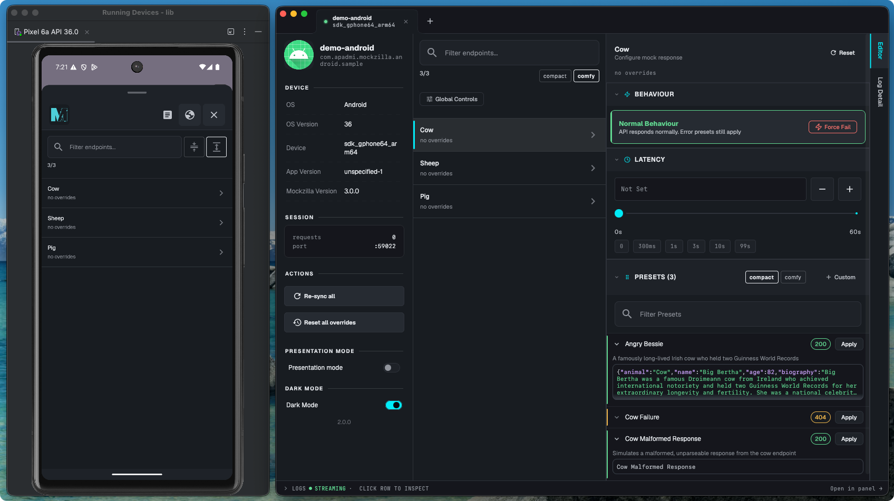

# Mockzilla

[](https://github.com/Apadmi-Engineering/Mockzilla/actions/workflows/action_deploy_binaries.yml)
[](LICENSE)
[](https://central.sonatype.com/artifact/com.apadmi/mockzilla)
[](https://pub.dev/packages/mockzilla)
[](https://mockzilla.apadmi.dev/)

## What is Mockzilla?

A solution for running and configuring a local HTTP server to mimic REST API endpoints used by your Android, iOS, Flutter, or [Kotlin Multiplatform](https://kotlinlang.org/docs/multiplatform.html) application.

The source code is written in Kotlin but is fully compatible with Swift, Dart bindings are also provided!

## Advantages

✅ Compile safe mock endpoint definitions.

✅ HTTP client agnostic.

✅ Works completely offline.

✅ Entirely self-contained in your application's codebase.

✅ Edit responses live from a [desktop app](https://mockzilla.apadmi.dev/desktop/overview/) or an [in-app overlay](https://mockzilla.apadmi.dev/mobile_ui/) — no rebuild required.

✅ [Presets](https://mockzilla.apadmi.dev/presets/) for one-tap switching between success, error, and edge-case responses.

## Control mocks live, while your app runs 🎛️

Beyond defining mocks in code, Mockzilla ships two ways to change what's returned *while your app is running* — force an endpoint to fail, add artificial latency, or apply a preset, all without touching code or rebuilding:

- **[Mockzilla Desktop](https://mockzilla.apadmi.dev/desktop/overview/)**: A companion app that connects to your device over Wifi.
- **[Mockzilla Mobile UI](https://mockzilla.apadmi.dev/mobile_ui/)**: An overlay you embed directly in your app.



## Quick Start 🚀

Head to the [quick start guide](https://mockzilla.apadmi.dev/quick-start/) to get up and running, or jump straight to a specific topic:

- [Configuring Endpoints](https://mockzilla.apadmi.dev/endpoints/)
- [Mockzilla Desktop](https://mockzilla.apadmi.dev/desktop/overview/)
- [Mockzilla Mobile UI](https://mockzilla.apadmi.dev/mobile_ui/)
- [Presets](https://mockzilla.apadmi.dev/presets/)

## Why's it useful? 🙌

Development servers go down, endpoints can be late being delivered or not exist at all! Mockzilla aims to easily provide a way of simulating your server from within your mobile application's codebase.

## Why not use a hosted solution? ☁️

Hosted mocking solutions can be powerful mocking tools in many cases. They have their downsides:

1. They can go down, Mockzilla works offline!
2. There's no compile-time checking
3. They require active maintenance with no compile-time safety if APIs change.

## What makes it compile safe? 🖥️

By defining your mocks using the same model classes as are used for deserialization, changing them, means changing the mocks or we get compiler errors! 😎

Example using [kotlinx.serialization](https://github.com/Kotlin/kotlinx.serialization):

#### Existing networking models

```kotlin
@Serializable
data class HelloWorldResponse(val greeting: String)
```

#### Mocking code
```kotlin
val myEndpoint = EndpointConfiguration.Builder("hello-world")
    .setPatternMatcher { uri.endsWith("hello-world") }
    .setDefaultHandler {
        MockzillaHttpResponse(
            body = Json.encodeToString(
                // Using existing models
                HelloWorldResponse(greeting = "Hello world!")
            )
        )
    }
```

## Important Note 🛑

Mockzilla is designed as a development and test tool **only**.

Mockzilla should **never be used in production**. Its traffic is unprotected and by nature of running a server on device, it can introduce security issues.

**Do not ship it to production**.

## Contributing

Contributions are welcome! See [CONTRIBUTING.md](CONTRIBUTING.md) for how to get set up.
