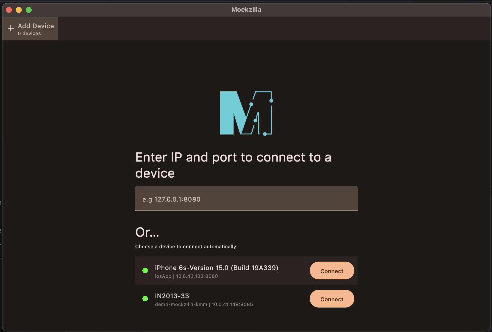
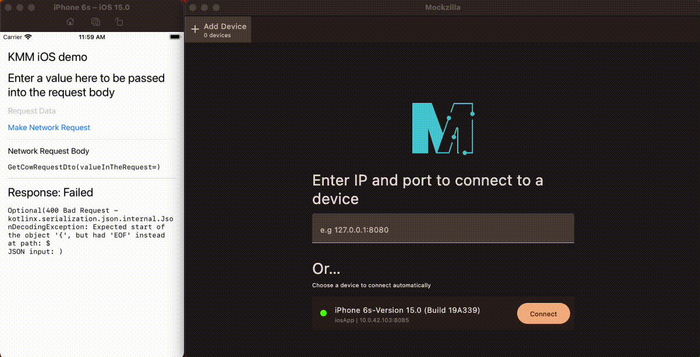

# Mockzilla Desktop

The Mockzilla desktop app can be downloaded [here](https://mockzilla-test.pages.dev/).

It allows manipulation of the mock data being returned by Mockzilla on your device.

!!! important
    You **must** be using the same Wifi network on your device running Mockzilla and the device running
    the destkop app.

### (1): Connect your device

Your device should be automatically discovered by Mockzilla (you may need to restart the app on your device).

!!! note
    If network discovery does not find your device you can manually type in the IP address of your device. (Don't forget the port!)

### (2): Edit the mock data

Use the tools to change the data for specific endpoints.

