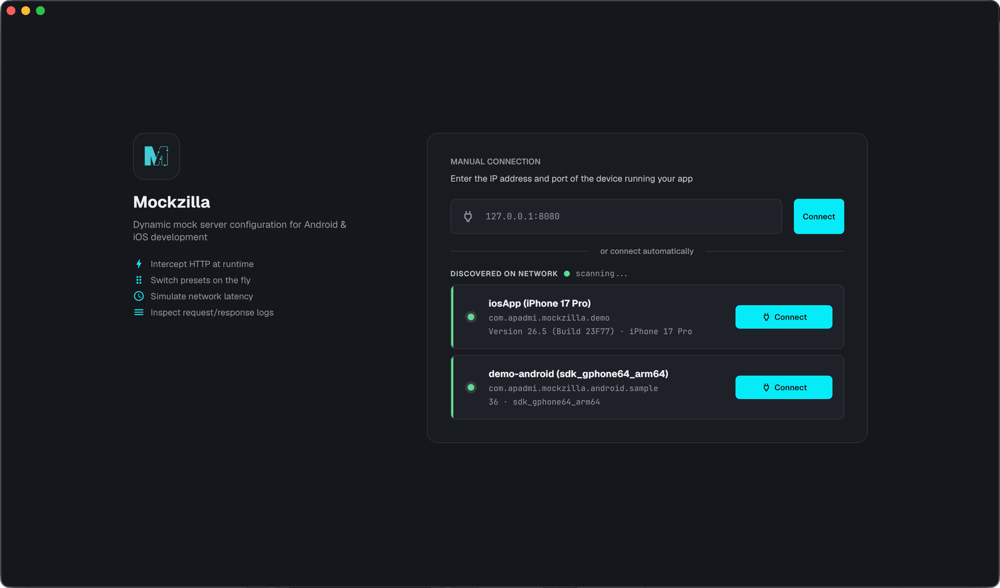
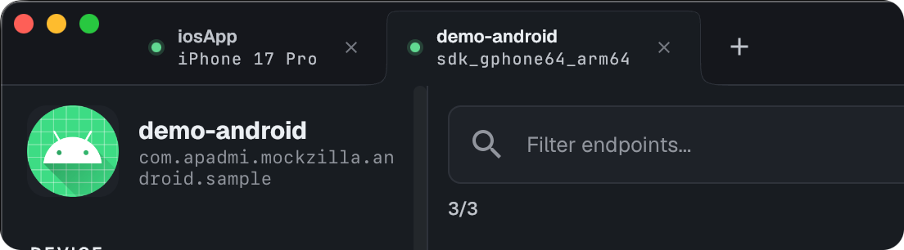
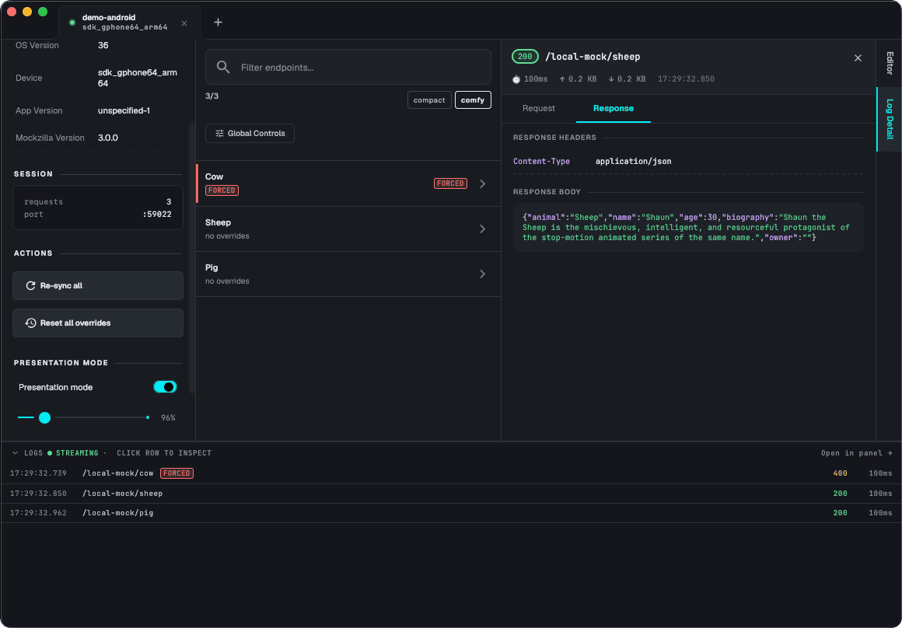
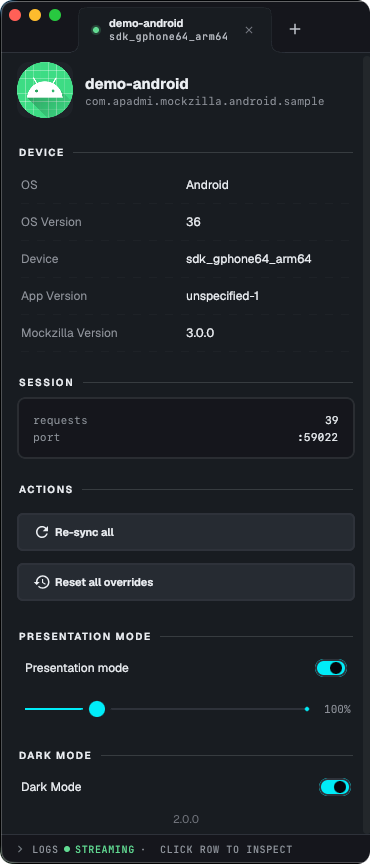

# Mockzilla Desktop (beta)

Mockzilla Desktop is a companion app that connects to Mockzilla on your device over your local network, letting you override responses, force failures, and adjust latency live - no code changes or rebuilds required.

<div class="mz-download-cta">
  <a href="{{ get_download_site_url() }}" class="md-button md-button--primary">Download Mockzilla Desktop</a>
  <p>macOS &middot;  Windows &middot; Linux</p>
</div>

!!! important
    You **must** be using the same Wi-Fi network on your device running Mockzilla and the device running
    the desktop app.

## Preparation

On iOS add the following to your Info.plist.
 
```xml
<key>NSBonjourServices</key>
<array>
  <string>_mockzilla._tcp</string>
</array>
```

This allows your device to be automatically detected on the network.

## Connecting a device

Your device should be automatically discovered by Mockzilla (you may need to restart the app on your device). Android emulators are also detected automatically, with no extra setup required.



!!! note
    If network discovery does not find your device you can manually type in the IP address of your device. (Don't forget the port!)

### Multiple devices

You can connect to more than one device at once - each connected device gets its own tab along the top of the window, so you can switch between them without losing your place. Use the "+" tab to connect another device, and close a tab's ✕  to disconnect.



## Editing mock data

Once connected, the app allows you to manipulate the latency of responses as well as their content in different ways.

### Apply a Preset

A preset is a predefined response defined in code to cater for a given scenario. 

<video autoplay loop muted playsinline controls>
  <source src="img/presets.mp4" type="video/mp4">
</video>

### Adjust Latency

Latency can be adjusted on the fly to help debug loading states and to simulate slow networks.

<video autoplay loop muted playsinline controls>
  <source src="img/latency.mp4" type="video/mp4">
</video>

### Force an endpoint to fail

Forcing an endpoint to fail causes the `errorHandler` in code to be called (defaulting to a 400 error).

<video autoplay loop muted playsinline controls>
  <source src="img/force-fail.mp4" type="video/mp4">
</video>

## Global Controls

To adjust latency on all endpoints or force all endpoints to fail, use the global controls.

<video autoplay loop muted playsinline controls>
  <source src="img/global-overrides.mp4" type="video/mp4">
</video>

## Monitor logs

The bottom panel is a live log of every request your device makes through Mockzilla, whether "Force failure" was enabled or not.

Each entry shows the request URL, status code, and response time - colour-coded so slow responses and errors stand out - along with a badge showing whether the response was the result of forced failure ("FORCED"). Selecting a log entry opens its full details: request and response headers, and body content.



## Miscellaneous controls

Alongside the device/app info panel you'll find a few utility controls:

- **Refresh all** - re-fetches the latest state from the connected device.
- **Clear overrides** - same as "Reset all" in Global Controls.
- **Presentation mode** - scales the entire UI, handy when demoing on a projector or a shared screen.
- **Dark mode** - forces dark theme regardless of your OS setting.



## Known limitations

- The desktop app enforces a minimum compatible Mockzilla server version (`2.0.0`) - if the app you're connecting to bundles an older `mockzilla` library, you'll see an "unsupported version" message instead of the dashboard. Update the `mockzilla` dependency in your app to resolve this.
- **Linux is not officially supported.** The desktop app is provided as-is on Linux - rendering issues may occur, and this platform doesn't receive the same testing as macOS and Windows.
