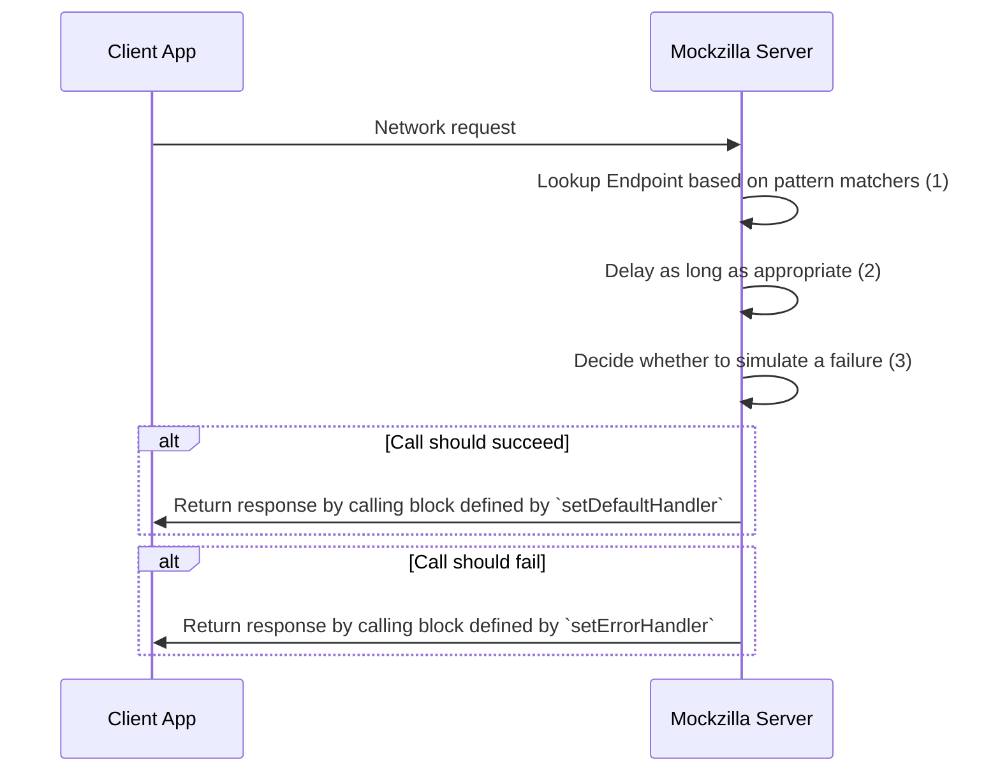

# Configuring Endpoints

## Simple Example

=== "Kotlin"
    ```kotlin
    val endpoint = EndpointConfiguration.Builder("Hello World")
        .setDefaultHandler {
            MockzillaHttpResponse(
                statusCode = HttpStatusCode.OK,
                headers = mapOf("test-header" to "test-value"),
                body = "{}"
            )
        })
        .setPatternMatcher { uri.endsWith("greeting") }
        .build()
    ```
=== "Swift"
    ```swift
    let endpoint = EndpointConfigurationBuilder(id: "Hello world")
        .setDefaultHandler { _ in
            MockzillaHttpResponse(
                statusCode: HttpStatusCode.OK,
                headers: ["test-header": "test-value"],
                body: "{}"
            )
        }.setSwiftPatternMatcher {
            $0.uri.hasSuffix("greeting")
        }.build()
    ```
=== "Flutter"
    ```dart
    final endpoint = EndpointConfig(
        name: "Greeting",
        endpointMatcher: (request) => request.uri.endsWith("greeting"),
        defaultHandler: (request) => const MockzillaHttpResponse(
            headers: {"key": "value"},
            body: "Hello world",
        ),
        errorHandler: (request) => const MockzillaHttpResponse(statusCode: 500),
    );
    ```

We can then call this endpoint as follows:
```bash
SHELL % curl -v http://localhost:8080/local-mock/greeting 
*   Trying 127.0.0.1:8080...
* Connected to 127.0.0.1 (127.0.0.1) port 8080 (#0)
> GET /local-mock/greeting HTTP/1.1
> Host: 127.0.0.1:8080
> User-Agent: curl/7.87.0
> Accept: */*
> 
* Mark bundle as not supporting multiuse
< HTTP/1.1 200 OK
< Connection: close
< Content-Length: 12
< Content-Type: text/plain; charset=UTF-8
< 
Hello world
* Closing connection 0
```

(This assumes your app is running on a simulator and accessible on localhost, replace the `localhost` with your device IP if running on device.)

## Compile-time Safety

This relies on a simple concept: **Use the same set of model classes for deserialization and for your mocks!**.

Example:

=== "Kotlin"
    ```kotlin

    .setDefaultHandler {
        MockzillaHttpResponse(
            body = Json.encodeToString(MyDtoResponseClass("my value"))
        )
    })
    ```
=== "Flutter"
    It is recommended to use a JSON serialization library such as [freezed](https://pub.dev/packages/freezed) or [json_serializable](https://pub.dev/packages/json_serializable) that can generate `toJson()`/`fromJson()` method for you.
    ```dart
    MockzillaHttpResponse(
      body: jsonEncode(
        FetchDeparturesResponse(
          departures: [
            Departure(
              arrival: DateTime.now().add(const Duration(minutes: 2)),
              destination: "East Didsbury",
              tramType: TramType.single,
            )
          ],
        ),
      ),
    );
    ```

## Advanced Usage

When calling the Mockzilla server from your app's code the following happens:



### (1) - Pattern matchers

The pattern matching block is how Mockzilla maps an incoming network request to a given endpoint.

Given the request data, return `true` if the given endpoint should map to this endpoint.

Request data is accessible as follows:

=== "Kotlin"
    ```kotlin
        EndpointConfiguration.Builder("Hello world")
            .setPatternMatcher { 
                // this: MockzillaHttpRequest
            }
    ```
=== "Swift"
    ```swift
        EndpointConfigurationBuilder(id: "Hello world")
            .setSwiftPatternMatcher {
                // $0: MockzillaHttpRequest
            }
    ```
=== "Flutter"
    ```dart
    EndpointConfig(
        name: "Hello world",
        endpointMatcher: (request) =>
            request.method == HttpMethod.get && request.uri.endsWith("/departures"),
        /* Handlers */
    )
    ```

Where `MockzillaHttpRequest` is defined as follows.

```kotlin
data class MockzillaHttpRequest(
    val uri: String,
    val headers: Map<String, String>,
    val body: String = "",
    val method: HttpMethod,
)
```

### (2) - Artificial Latency

The following can be configured globally across all endpoints [here](./dokka/mockzilla-common/com.apadmi.mockzilla.lib.models/-mockzilla-config/-builder/).

Network requests generally don't complete instantly. Mockzilla mimics the latency of a network and can be configured 
either across all endpoints on the top level config, or on individual endpoints as follows:

=== "Kotlin"
    ```kotlin
        EndpointConfiguration.Builder("Hello world")
          .setMeanDelayMillis(100)
    ```
=== "Swift"
    ```swift
        EndpointConfigurationBuilder(id: "Hello world")
          .setMeanDelayMillis(delay: 100)
    ```
=== "Flutter"
    ```dart
    EndpointConfig(
        name: "Fetch departures",
        endpointMatcher: (request) => request.uri.endsWith("/departures"),
        defaultHandler: (request) => MockzillaHttpResponse(
        body: jsonEncode(const FetchDeparturesResponse(departures: []))),
        errorHandler: (request) => const MockzillaHttpResponse(statusCode: 418),
        delayMean: 100,
        delayVariance: 20,
    )
    ```

!!! note

    | Default values |       |
    |----------------|-------|
    | Delay Mean     | 100ms |

For each individual request invocation, an artificial delay is added.

### (3) - Artificial Errors

The following can be configured globally across all endpoints [here](./dokka/mockzilla-common/com.apadmi.mockzilla.lib.models/-mockzilla-config/-builder/).

Mockzilla supports artificially causing network requests to fail.

=== "Kotlin"
    ```kotlin
    EndpointConfiguration.Builder("Hello world")
    .setShouldFail(true)
    ```
=== "Swift"
    ```swift
    EndpointConfigurationBuilder(id: "Hello world")
    .setShouldFail(shouldFail: true)
    ```
=== "Flutter"
    ```dart
    EndpointConfig(
        name: "Fetch departures",
        endpointMatcher: (request) => request.uri.endsWith("/departures"),
        defaultHandler: (request) => MockzillaHttpResponse(
        body: jsonEncode(const FetchDeparturesResponse(departures: []))),
        errorHandler: (request) => const MockzillaHttpResponse(statusCode: 418),
        failureProbability: 0
    )
    ```
    **The default failure probability is 0**.