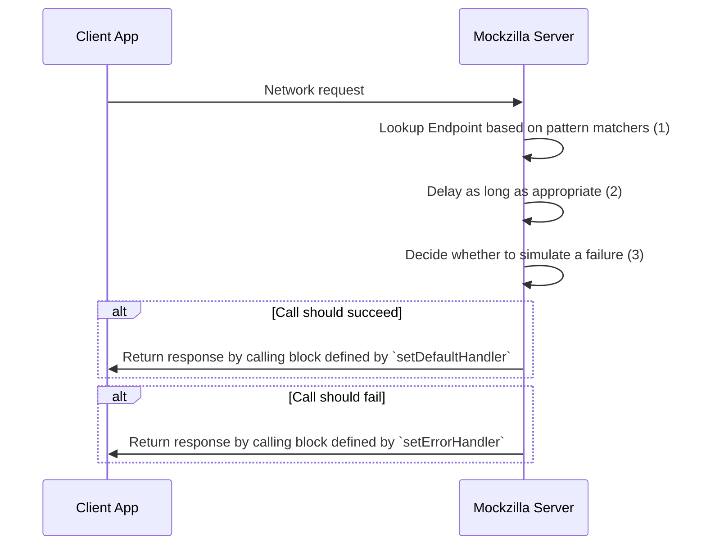

# Configuring Endpoints

## Simple Example

=== "Kotlin"
    ```kotlin
    val endpoint = EndpointConfiguration.Builder("Hello World")
        .setDefaultHandler {
            MockzillaHttpResponse(
                statusCode = HttpStatusCode.OK,
                headers = mapOf("test-header" to "test-value"),
                body = "{}"
            )
        })
        .setPatternMatcher { uri.endsWith("greeting") }
        .build()
    ```
=== "Swift"
    ```swift
    let endpoint = EndpointConfiguration.Builder(id: "Hello world")
        .setDefaultHandler { _ in
            MockzillaHttpResponse(
                statusCode: HttpStatusCode.OK,
                headers: ["test-header": "test-value"],
                body: "{}"
            )
        }.setSwiftPatternMatcher {
            $0.uri.hasSuffix("greeting")
        }.build()
    ```

We can then call this endpoint as follows:
```bash
SHELL % curl -v http://localhost:8080/local-mock/greeting 
*   Trying 127.0.0.1:8080...
* Connected to 127.0.0.1 (127.0.0.1) port 8080 (#0)
> GET /local-mock/greeting HTTP/1.1
> Host: 127.0.0.1:8080
> User-Agent: curl/7.87.0
> Accept: */*
> 
* Mark bundle as not supporting multiuse
< HTTP/1.1 200 OK
< Connection: close
< Content-Length: 12
< Content-Type: text/plain; charset=UTF-8
< 
Hello world
* Closing connection 0
```

(This assumes your app is running on a simulator and accessible on localhost, replace the `localhost` with your device IP if running on device.)

## Compile-time Safety

This relies on a simple concept: **Use the same set of model classes for deserialization and for your mocks!**.

Example:

```kotlin

.setDefaultHandler {
    MockzillaHttpResponse(
        body = Json.encodeToString(MyDtoResponseClass("my value"))
    )
})
```

## Advanced Usage

When calling the Mockzilla server from your app's code the following happens:



### (1) - Pattern matchers

The pattern matching block is how Mockzilla maps an incoming network request to a given endpoint.

Given the request data, return `true` if the given endpoint should map to this endpoint.

Request data is accessible as follows:

=== "Kotlin"
    ```kotlin
        EndpointConfiguration.Builder("Hello world")
            .setPatternMatcher { 
                // this: MockzillaHttpRequest
            }
    ```
=== "Swift"
    ```swift
        EndpointConfiguration.Builder(id: "Hello world")
            .setSwiftPatternMatcher {
                // $0: MockzillaHttpRequest
            }
    ```

Where `MockzillaHttpRequest` is defined as follows.

```kotlin
data class MockzillaHttpRequest(
    val uri: String,
    val headers: Map<String, String>,
    val body: String = "",
    val method: HttpMethod,
)
```

### (2) - Artificial Latency

The following can be configured globally across all endpoints [here](../dokka/mockzilla-common/com.apadmi.mockzilla.lib.models/-mockzilla-config/-builder/).

Network requests generally don't complete instantly. Mockzilla mimics the latency of a network and can be configured 
either across all endpoints on the top level config, or on individual endpoints as follows:

=== "Kotlin"
    ```kotlin
        EndpointConfiguration.Builder("Hello world")
          .setMeanDelayMillis(100)
          .setDelayVarianceMillis(20)
    ```
=== "Swift"
    ```swift
        EndpointConfiguration.Builder(id: "Hello world")
          .setMeanDelayMillis(delay: 100)
          .setDelayVarianceMillis(variance: 20)
    ```

!!! note

    | Default values |       |
    |----------------|-------|
    | Delay Mean     | 100ms |
    | Delay Variance | 20ms  |

For each individual request invocation, an artificial delay is added.

The delay will be randomised and sit somewhere between $delayMean - delayVariance$ and $delayMean + delayVariance$

### (3) - Artificial Errors

The following can be configured globally across all endpoints [here](../dokka/mockzilla-common/com.apadmi.mockzilla.lib.models/-mockzilla-config/-builder/).

Mockzilla supports artificially causing network requests to fail.

For each individual request invocation, the decision on whether the request should fail is made based on the failure probability.

=== "Kotlin"
    ```kotlin
    EndpointConfiguration.Builder("Hello world")
    .setFailureProbability(0)
    ```
=== "Swift"
    ```swift
    EndpointConfiguration.Builder(id: "Hello world")
    .setFailureProbability(percentage: 0)
    ```

**The default failure probability is 0**.