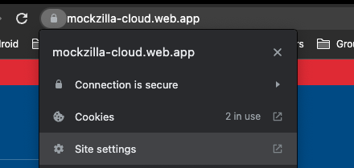
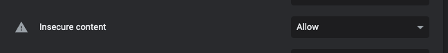
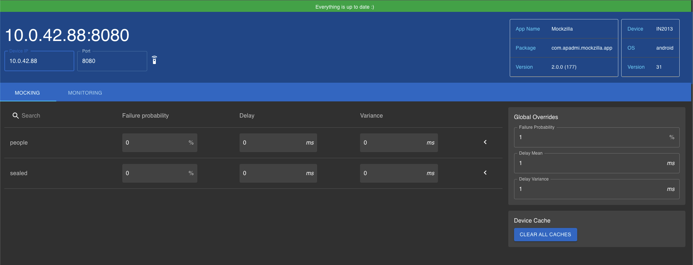
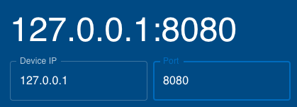

# Web Portal

!!! warn
	The web portal is a little flaky, our next priority is a complete rewrite. 
	It is currently provided for convenience but we don't intend to do non-critical maintenance until 
	the rewrite is complete.

	**Currently the web portal only supports JSON responses.**

It can be helpful to override the way Mockzilla behaves at runtime without recompiling.

To do this the Mockzilla web interface connects to the server on device and allows modifying the configuration at runtime.

The web portal is here: `https://mockzilla-cloud.web.app/`.

## Important #1 - Enable insecure content

The on device servers cannot serve content over a secure connection. You must allow your web browser to consume insecure content or **nothing will work**.

For Google Chrome:

1. Open "Site Settings" by tapping the padlock in the URL bar

	
2. Enable insecure content

	
	
Other browsers aren't properly supported and may or may not work.

## Connecting to the device

1. **Ensure your device and development machine are on the same Wifi network**.
2. Ensure the app is running and in the foreground

### Physical Devices

Enter the IP address of your device (check the Wifi settings) and enter them into the web interface. The website should turn green and indicate it's connected.



### iOS Simulators

Simply enter the localhost IP address and everything should connect.



### Android Emulators

Android Emulators require port forwarding to work correctly.

1. Install [ADB](https://developer.android.com/studio/command-line/adb).
2. Run this script: [https://github.com/Apadmi-Engineering/Mockzilla/blob/develop/scripts/android-emulator-connect.sh](). It will launch the web portal with the correct ip address and port.

(This will also work with physical Android devices connected over ADB).

## Usage

Hopefully usage is self explaintory. Changing values in the web portal will affect the behaviour of the mock server accordingly.

Expand a given endpoint to change its response body. The changes will be cached until the app is uninstalled or the cache is cleared with the "Clear all caches" button.

!!! note
	When overriding behaviour through the mock, the override is total. **Your handler defined in code will not be called**.

## Specifying example JSON

The web portal will be prepoplated with JSON to make it easier to edit. By default Mockzilla calls your `defaultHandler` with an empty request to get this data.

This may cause issues if for example you're parsing the request body. In this case you can specify manually what data the web portal is prepopulated with.

```
myEndpointConfigurationBuilder
	.setWebApiDefaultResponse(MockzillaHttpResponse(body = "{ \"demo\": \"my demo json\" }"))

```


